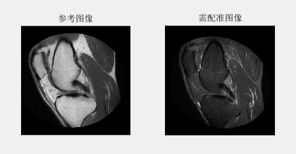

在CSDN 上看到了一篇，关于“医学图像配准”的介绍

原文链接：https://blog.csdn.net/u012258999/article/details/42972391 

原始作者：godloveljw  

在原作者的基础上，调整了部分参数和图像显示

配准过程：

- 配置优化器和度量准则

- 提高配准精度

- 改变优化器的步长已达到对更加精细的变换

- 改变最大迭代次数

- 改变初始条件提高精度

